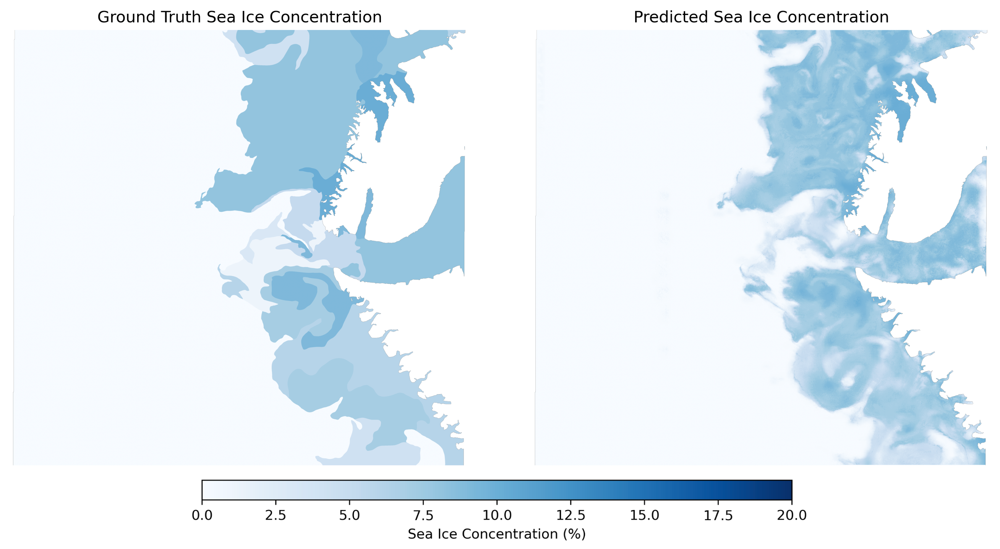

# Sea Ice Concentration Prediction

Deep learning for predicting sea ice concentration from SAR imagery provided in the AI4Arctic Sea Ice Challenge Dataset (Buus-Hinkler et al., 2022).

## Installation Instructions

1. Create a clean conda environment with Python 3.10:

  `conda create -n seaice python=3.10`

2. Activate your conda environment:

  `conda activate seaice`

3. Clone this repository:

  `git clone https://github.com/eric-taylor-geo/sea-ice.git`

4. Navigate to the repository location on your machine and run:

  `pip install .`

5. seaice is now installed and can be used in your seaice conda environment using:

  `import seaice`

- [Data](https://drive.google.com/drive/folders/12V9hCvVinGxBBfMi7AGsu-pXXqNbg4b7?usp=drive_link)

  ## Example usage

  Example usage of training and prediction is provided in `demo.ipynb`.

  Weights and data are available at [ TBC ].

  Original data from Buus-Hinkler et al. (2022).